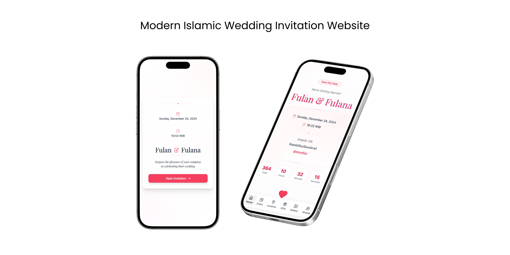

# Sakeenah: Modern Islamic Wedding Invitation Platform


## Overview

Sakeenah is a production-ready, database-driven wedding invitation platform designed for modern couples who value both aesthetics and functionality. Built on a scalable client-server architecture with PostgreSQL multi-tenancy, it enables hosting unlimited wedding invitations from a single deployment with personalized guest experiences.



## Core Features

### Guest Management

- Personalized invitation links with base64-encoded guest names
- Automated name pre-filling in hero sections and wish forms
- Attendance tracking (attending, not attending, undecided)
- Real-time wish submission with PostgreSQL persistence

### Multi-Tenant System

- Unique wedding identifiers (UIDs) for URL routing
- Database-driven wedding data (no code changes needed)
- Isolated wishes and analytics per wedding
- Centralized deployment for unlimited events

### User Experience

- Smooth animations powered by Framer Motion
- Background music controls with autoplay support
- Countdown timer to wedding date
- Google Maps integration for venue directions
- Digital envelope with bank account details

## Technical Stack

| Layer      | Technology         | Purpose                                   |
| ---------- | ------------------ | ----------------------------------------- |
| Runtime    | Bun 1.3.5          | Package management and server execution   |
| Frontend   | React 18 + Vite    | Fast build tooling and reactive UI        |
| Backend    | Hono               | Lightweight edge-compatible API framework |
| Database   | PostgreSQL         | Multi-tenant data storage                 |
| Styling    | Tailwind CSS       | Utility-first responsive design           |
| Deployment | Cloudflare Workers | Global edge network distribution          |

## Quick Start

### Prerequisites

- Bun v1.3.5 or later
- PostgreSQL v14+
- Git

### Installation

```bash
git clone https://github.com/mrofisr/sakeenah.git
cd sakeenah
bun install
cp .env.example .env
# Edit .env with your DATABASE_URL
bun run dev
```

For detailed setup instructions, see [Getting Started](docs/tutorials/getting-started.md).

## Documentation

| Section                                                  | Description                                     |
| -------------------------------------------------------- | ----------------------------------------------- |
| **Tutorials**                                            |                                                 |
| [Getting Started](docs/tutorials/getting-started.md)     | Set up your first wedding invitation            |
| **How-To Guides**                                        |                                                 |
| [Personalized Links](docs/how-to/personalized-links.md)  | Generate and distribute guest invitation links  |
| [Deployment](docs/how-to/deployment.md)                  | Deploy to Cloudflare Workers or other platforms |
| [Testing](docs/how-to/testing.md)                        | Write and run unit, integration, and E2E tests  |
| **Reference**                                            |                                                 |
| [API Reference](docs/reference/api.md)                   | REST API endpoints and schemas                  |
| [Project Structure](docs/reference/project-structure.md) | Codebase organization and conventions           |
| **Explanation**                                          |                                                 |
| [Architecture](docs/explanation/architecture.md)         | System design and technology choices            |
| [Security](docs/explanation/security.md)                 | Privacy features and data protection            |

## Scripts

```bash
# Development
bun run dev              # Run client + server concurrently
bun run dev:client       # Frontend only (Vite)
bun run dev:server       # Backend only (Hono API)

# Production
bun run build            # Build frontend to dist/
bun run deploy           # Build + deploy to Cloudflare Workers

# Utilities
bun run generate-links   # Generate personalized guest links
bun run lint             # ESLint code validation
```

## Browser Support

- Chrome/Edge 90+
- Firefox 88+
- Safari 14+
- Mobile Safari (iOS 14+)
- Chrome Mobile (Android 10+)

## Contributing

We welcome contributions! Please read our [Contributing Guide](CONTRIBUTING.md) for:

- Code of conduct
- Development setup
- Coding standards
- Pull request process

## License

Licensed under the Apache License 2.0. See [LICENSE](./LICENSE) for full terms.

Copyright (c) 2024-present mrofisr

## Acknowledgments

- Built with [Vite](https://vite.dev/), [React](https://react.dev/), and [Hono](https://hono.dev/)
- Animations by [Framer Motion](https://www.framer.com/motion/)
- Icons from [Lucide](https://lucide.dev/)
- Hosted on [Cloudflare Workers](https://workers.cloudflare.com/)

## Contact

- GitHub: [@mrofisr](https://github.com/mrofisr)
- Instagram: [@mrofisr](https://instagram.com/mrofisr)

---

**"And among His signs is that He created for you spouses from among yourselves so that you may find comfort in them."** - Quran 30:21
